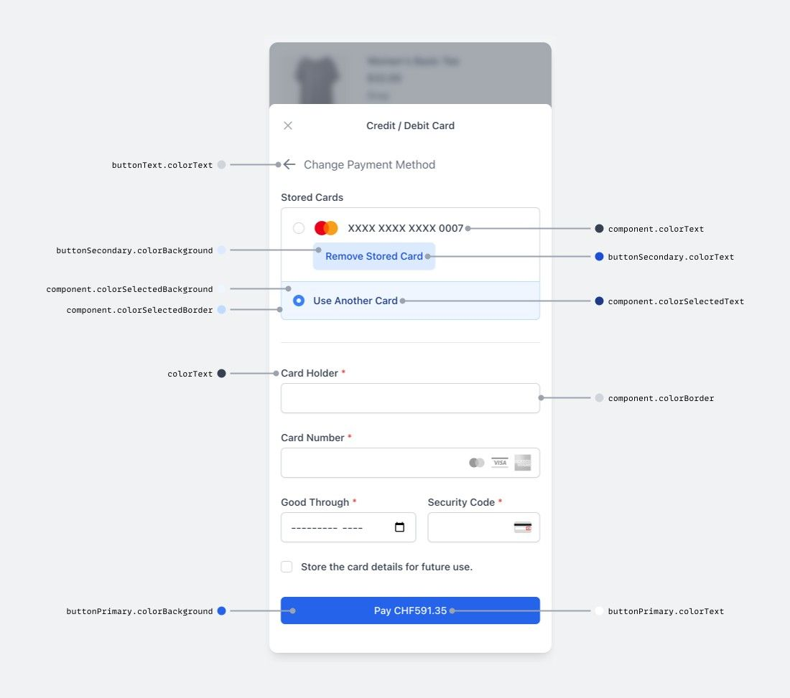

# Theming

- [Theming](#theming)
  - [Colors](#colors)
  - [Animation](#animation)
  - [Default themes](#default-themes)
    - [Light theme](#light-theme)
    - [Dark theme](#dark-theme)

The appearance of the payment dialog can be customized to match the look and feel of your app. This can be done for both the light and dark theme individually.

Colors can be modified by passing a JSON object to the `WalleeTestSdk` instance. You can either completely override the theme or only change certain colors.

- `paymentSdk.setLightTheme(NSMutableDictionary)` allows to modify the payment dialog's light theme.
- `paymentSdk.setDarkTheme(NSMutableDictionary)` allows to modify the payment dialog's dark theme.
- `paymentSdk.setCustomTheme(NSMutableDictionary|| nil, ThemeEnum)` allows to enforce a specific theme (dark, light or your own).

```swift
// ...
import UIKit
import WalleeTestSdk


class ViewController : UIViewController, WalleeTestResultObserver {

    let paymentSdk = WalleeTestSdk (eventObserver: self)

    @IBAction func openSdkClick()
    {
        ....
        changeColorSchema()
        ...
    }

    private func changeColorSchema()
    {
        paymentSdk.setLightTheme(light: getLightTheme())
    }

}
```

This overrides the colors `colorBackground`, `colorText`, `colorHeadingText` and `colorError` for both the dark and light theme.

The `changeColorSchema` function allows to define the theme to be used by the payment dialog and prevent it from switching themes based on the user's settings. This way e.g. high-contrast and low-contrast themes can be added. The logic for switching between these themes is up to you though.

You can also use `setCustomTheme` to force the usage of the light or dark theme.

```swift
paymentSdk.setCustomTheme(custom: getNewCustomTheme(), baseTheme: .DARK)
```

```swift
paymentSdk.setCustomTheme(custom: getNewCustomTheme(), baseTheme: .LIGHT)
```

### Colors

  

### Animation

Use `setAnimation` method to change the screen change animation. Currently avaliable options are: `AnimationEnum.SLIDE` and `AnimationEnum.BUBBLE`. Default value is `AnimationEnum.SLIDE`. `WalleeTestSdk.instance?.setAnimation(AnimationEnum.BUBBLE)` allows to modify the payment dialog's dark theme.  

### Default themes

#### Light theme

The theme can be provided via a function that returns an NSMutableDictionary object that holds the key-value pair for the colors.

```swift
func getLightTheme() -> NSMutableDictionary {

   let lightTheme = NSMutableDictionary()

   lightTheme.setValue("#3b82f6", forKey: "colorPrimary")
   lightTheme.setValue("#ffffff", forKey: "colorBackground")
   lightTheme.setValue("#374151", forKey: "colorText")
   lightTheme.setValue("#6b7280", forKey: "colorSecondaryText")
   lightTheme.setValue("#111827", forKey: "colorHeadingText")
   lightTheme.setValue("#ef4444", forKey: "colorError")

   let component = NSMutableDictionary()
   componentsetValue("#ffffff", forKey: "colorBackground")
   componentsetValue("#d1d5db", forKey: "colorBorder")
   componentsetValue("#374151", forKey: "colorText")
   componentsetValue("#4b5563", forKey: "colorPlaceholderText")
   componentsetValue("#3b82f6", forKey: "colorFocus")
   componentsetValue("#1e3a8a", forKey: "colorSelectedText")
   componentsetValue("#eff6ff", forKey: "colorSelectedBackground")
   componentsetValue("#bfdbfe", forKey: "colorSelectedBorder")
   componentsetValue("#80808019", forKey: "colorDisabledBackground")
   lightTheme.setValue(component, forKey: "component")

   let buttonPrimary = NSMutableDictionary()
   buttonPrimary.setValue("#2563eb", forKey: "colorBackground")
   buttonPrimary.setValue("#ffffff", forKey: "colorText")
   buttonPrimary.setValue("#1d4ed8", forKey: "colorHover")
   lightTheme.setValue(buttonPrimary, forKey: "buttonPrimary")

   let buttonSecondary = NSMutableDictionary()
   buttonSecondary.setValue("#bfdbfe", forKey: "colorBackground")
   buttonSecondary.setValue("#1d4ed8", forKey: "colorText")
   buttonSecondary.setValue("#bfdbfe", forKey: "colorHover")
   lightTheme.setValue(buttonSecondary, forKey: "buttonSecondary")

   let buttonText = NSMutableDictionary()
   buttonText.setValue("#6b7280", forKey: "colorText")
   buttonText.setValue("#374151", forKey: "colorHover")
   lightTheme.setValue(buttonText, forKey: "buttonText")

   let buttonIcon = NSMutableDictionary()
   buttonIcon.setValue("#9ca3af", forKey: "colorText")
   buttonIcon.setValue("#6b7280", forKey: "colorHover")

   lightTheme.setValue(buttonIcon, forKey: "buttonIcon")
   return lightTheme
}
```

#### Dark theme

```swift
func getDarkTheme() -> NSMutableDictionary{

    let darkTheme = NSMutableDictionary()

    darkTheme.setValue("#3b82f6", forKey: "colorPrimary")
    darkTheme.setValue("#1f2937", forKey: "colorBackground")
    darkTheme.setValue("#e5e7eb", forKey: "colorText")
    darkTheme.setValue("#9ca3af", forKey: "colorSecondaryText")
    darkTheme.setValue("#f9fafb", forKey: "colorHeadingText")
    darkTheme.setValue("#ef4444", forKey: "colorError")

    let component = NSMutableDictionary()
    component.setValue("#374151", forKey: "colorBackground")
    component.setValue("#6b7280", forKey: "colorBorder")
    component.setValue("#f3f4f6", forKey: "colorText")
    component.setValue("#9ca3af", forKey: "colorPlaceholderText")
    component.setValue("#3b82f6", forKey: "colorFocus")
    component.setValue("#f3f4f6", forKey: "colorSelectedText")
    component.setValue("#4b5563", forKey: "colorSelectedBackground")
    component.setValue("#9ca3af", forKey: "colorSelectedBorder")
    component.setValue("#9ca3af", forKey: "colorDisabledBackground")
    darkTheme.setValue(component, forKey: "component")

    let buttonPrimary = NSMutableDictionary()
    buttonPrimary.setValue("#2563eb", forKey: "colorBackground")
    buttonPrimary.setValue("#ffffff", forKey: "colorText")
    buttonPrimary.setValue("#1d4ed8", forKey: "colorHover")
    darkTheme.setValue(buttonPrimary, forKey: "buttonPrimary")

    let buttonSecondary = NSMutableDictionary()
    buttonSecondary.setValue("#6b7280", forKey: "colorBackground")
    buttonSecondary.setValue("#f3f4f6", forKey: "colorText")
    buttonSecondary.setValue("#4b5563", forKey: "colorHover")
    darkTheme.setValue(buttonSecondary, forKey: "buttonSecondary")

    let buttonText = NSMutableDictionary()
    buttonText.setValue("#9ca3af", forKey: "colorText")
    buttonText.setValue("#d1d5db", forKey: "colorHover")
    darkTheme.setValue(buttonText, forKey: "buttonText")

    let buttonIcon = NSMutableDictionary()
    buttonIcon.setValue("#d1d5db", forKey: "colorText")
    buttonIcon.setValue("#f3f4f6", forKey: "colorHover")
    darkTheme.setValue(buttonIcon, forKey: "buttonIcon")

    return darkTheme
}
```
